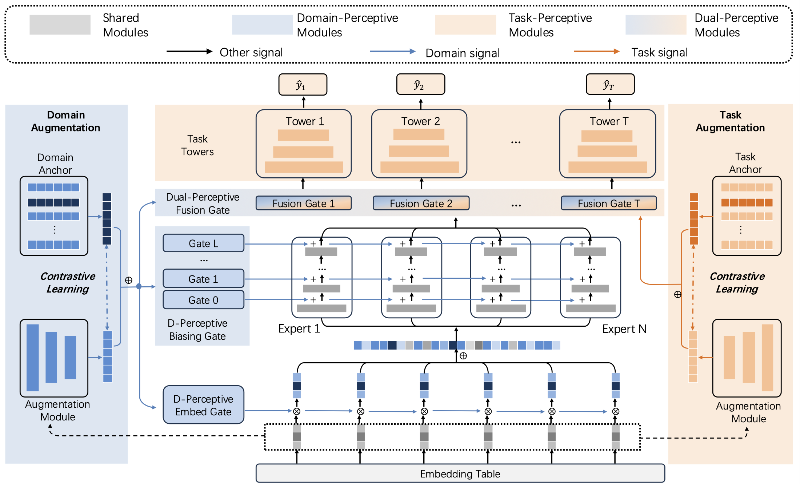

# HyperGate: Hierarchical Perceptive Gating Network for Multi-domain Multi-task Recommendation

<div align="center">
    
    <p>HyperGate: Hierarchical Perceptive Gating Network for Multi-domain Multi-task Recommendation</p>
</div>


## How to RUN

This repo relies on the RecStudio library. Please follow the instructions below to install and run the code.
```bash
git clone https://github.com/XuHwang/HyperGate.git
cd HyperGate/
git submodule init
git submodule update --remote --branch multi-domain-multi-task
```

To run HyperGate, the following steps are required:

1. Install the required packages:  
    ```bash
    conda env create -f RecStudio/environment.yml
    ```

2. Add recstudio to PYTHONPATH:
    ```bash
    export PYTHONPATH=./RecStudio
    ```

3. Run
    ```bash
    python main.py -m HyperGate -d kuairand --batch_size 1024 --eval_batch_size 512 --split_mode entry
    ```

## Citation
```
@inproceedings{recstudio2023,
    author = {Lian, Defu and Huang, Xu and Chen, Xiaolong and Chen, Jin and Wang, Xingmei and Wang, Yankai and Jin, Haoran and Fan, Rui and Liu, Zheng and Wu, Le and Chen, Enhong},
    title = {RecStudio: Towards a Highly-Modularized Recommender System},
    year = {2023},
    isbn = {9781450394086},
    publisher = {Association for Computing Machinery},
    address = {New York, NY, USA},
    url = {https://doi.org/10.1145/3539618.3591894},
    doi = {10.1145/3539618.3591894},
    booktitle = {Proceedings of the 46th International ACM SIGIR Conference on Research and Development in Information Retrieval},
    pages = {2890–2900},
    numpages = {11},
    keywords = {modularization, multi-stage, recommender system, web services},
    location = {Taipei, Taiwan},
    series = {SIGIR '23}
}
```
